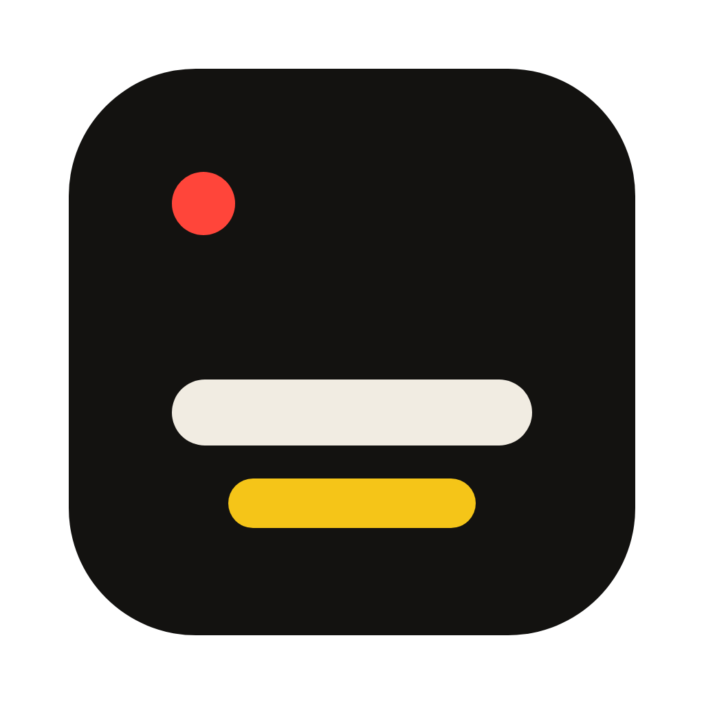

<div align="center">
  
  <h1>See Subtitles</h1>
  <p><strong>Live Cantonese → Mandarin subtitles for everyone in the room.</strong></p>
  <p>
    
    
    
  </p>
</div>

---

A Mac at the front of the room turns a Cantonese talk into Mandarin subtitles as it is spoken — on the
venue screen, over the slides, and on every phone that scans a code. When the talk ends the recording,
the full subtitles and a summary are already waiting.

It was built for real conferences, classrooms and meetings in Hong Kong and Guangdong, where following
the words is the difference between attending and taking part.

## What it does

**In the room.** A microphone on the speaker. Audio streams to Tencent 实时语音翻译 and each sentence
comes back translated as it finishes. Show it in a Display window on the projector, a transparent
Overlay over your slides on any screen, or a share link and QR code that puts the subtitles on every
phone — where each attendee picks translation, original or both, at their own text size.

**Afterwards.** Recording never touches the network, so a dropped connection pauses subtitles but
never the recording. When it stops you have an MP3, SRT subtitles in both languages, an MP4 with the
text burned in, and an AI summary with clickable timestamps as Markdown or a printable PDF. Cloud
re-subtitling can run the whole recording through again in one pass to fill anything the live
connection missed.

**Files, too.** Drop a video or audio file into the web app and get subtitles in minutes: edit the
cues, fix the timing, export SRT, VTT, plain text or a burned-in MP4.

## How it works

```
microphone ─► 48→16 kHz ─► Tencent 实时语音翻译 ─► sentence + translation
                                                        │
                        ┌───────────────────────────────┼───────────────────────────┐
                        ▼                               ▼                           ▼
                 Display window                  local recording              hosted mirror
                 Overlay on slides               MP3 · SRT · MP4              share link · QR
                                                 AI summary · PDF             every phone
```

The Mac does the capture, the display and the recording. The hosted server exists for the things a
laptop cannot do alone: the share link phones connect to, subtitling uploaded files, and re-running a
recording through whole-file recognition.

## Getting started

**Use it.** The app is distributed as a signed macOS build, and accounts are created by hand — there is
no self-service sign-up ([why](SECURITY.md)). What the app can do, screen by screen, is in
[docs/USING-THE-APP.md](docs/USING-THE-APP.md).

**Run your own.** The server is a Docker Compose stack with automatic HTTPS; you supply Tencent Cloud
credentials. → **[docs/SELF-HOSTING.md](docs/SELF-HOSTING.md)**

**Build from source.** Node 24, one `npm install`, and the app runs from the repository. →
**[docs/DEVELOPMENT.md](docs/DEVELOPMENT.md)**

```bash
npm install
npm run build:helpers -w desktop
npm start -w desktop
```

## Layout

| Path | |
|---|---|
| `core/` | The shared pipeline — Tencent signing, the streaming translator, the decimator, the recorder |
| `desktop/` | The macOS app: capture, Display and Overlay windows, recording, MP4, summaries |
| `server/` | The hosted side: accounts, the live mirror, upload jobs, the cue editor |
| `web/` | Every page, shared by both — app shell, display, attendee view, account, website |
| `deploy/` | docker-compose and Caddy |
| `design/` | Design tokens, icons and the canvas sources behind the interface |

## Status and limits

Honest about what this is: a working product run by one person, not a managed service.

- **macOS 13+ on Apple silicon** for the app. The web side runs in any browser.
- **Cantonese → Mandarin** is what it is tuned for. The upload pipeline also handles Mandarin,
  English, Japanese and Korean.
- **A server hands its Tencent credentials to every logged-in app**, so anyone with an account can
  spend your speech quota. `SIGNUP_MODE` is `closed` by default and should stay that way until the app
  receives short-lived credentials instead. This is the main open item — see
  [SECURITY.md](SECURITY.md).
- **Plan quotas are enforced by the app**, so they guide cooperating users rather than restrict
  anyone.
- The interface is English and Simplified Chinese; every string lives in one catalogue and a test
  fails the build if a screen is only half translated.

## Documentation

- [docs/USING-THE-APP.md](docs/USING-THE-APP.md) — the app in use: Live, Files, re-subtitling, summaries, 2FA
- [docs/DEVELOPMENT.md](docs/DEVELOPMENT.md) — build, run, test, release
- [docs/SELF-HOSTING.md](docs/SELF-HOSTING.md) — deploy the server, accounts, Tencent keys, backups
- [docs/HISTORY.md](docs/HISTORY.md) — where the pipeline came from and why parts are shaped as they are
- [SECURITY.md](SECURITY.md) — reporting a vulnerability, and the known design limits

## Licence

MIT — see [LICENSE](LICENSE). Bundled Instrument Sans and Instrument Serif are used under the SIL Open
Font License; their licences sit beside the fonts in `web/fonts/`.
